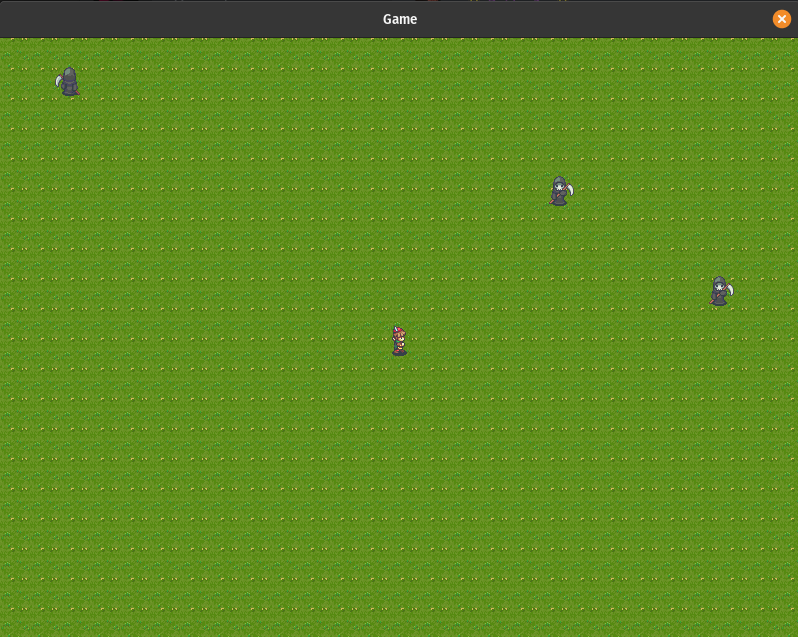

# Rust rpg game



RPG Game created in [Rust](https://www.rust-lang.org/) to learning the language 

## Running the game
```bash

# Clone the repo
git clone https://github.com/Redfox/rust-rpg.git
cd rust-rpg

# Run
cargo run —release

```

## Game controls

Use the `W`, `A`, `S`, `D`, key to move the player.

## Dependencies

* [sdl2](https://github.com/Rust-SDL2/rust-sdl2): 
  
  If not installed, to install in linux with:
  ```
    sudo apt install libsdl2-dev
    sudo apt install libsdl2-image-dev 
  ```

